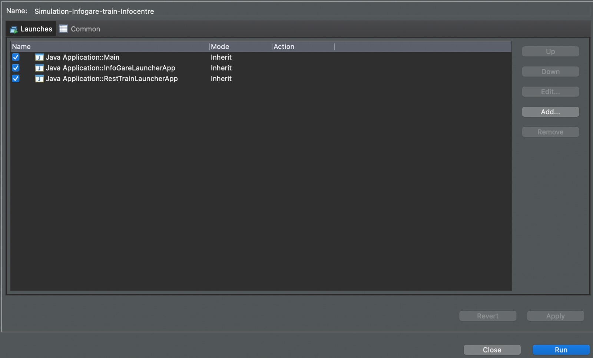
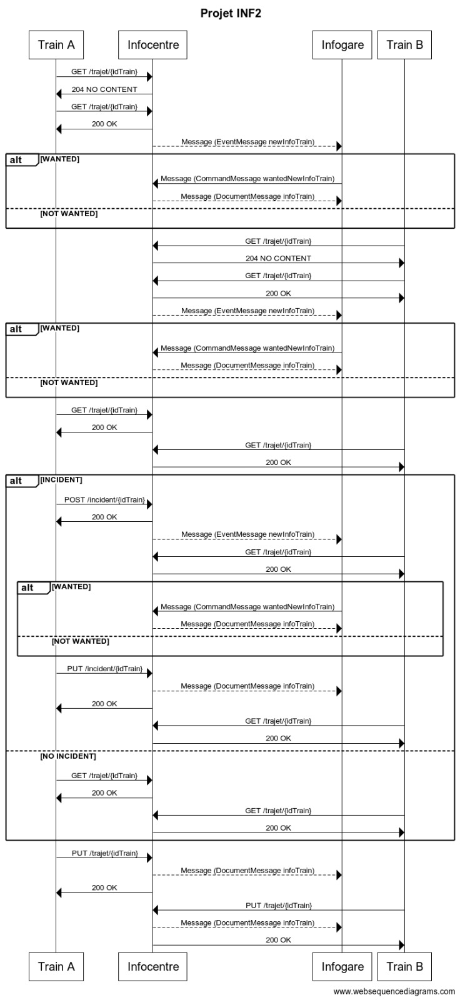

# INF2 Project

Infocentre - Train - Infogare

## Authors

* **David Ekchajzer** _alias_ [@da-ekchajzer](https://github.com/da-ekchajzer)
  * Fork/Main Repository &#8594; https://github.com/da-ekchajzer/M1_FRAMEWORK_EJB
* **Abdel Benamara** _alias_ [@Abdel-Benamara](https://github.com/Abdel-Benamara)
  * Fork &#8594; https://github.com/Abdel-Benamara/M1_FRAMEWORK_EJB
* **Mathieu Ridet** _alias_ [@mathieuridet](https://github.com/mathieuridet)
  * Fork &#8594; https://github.com/mathieuridet/M1_FRAMEWORK_EJB
* **Sophia Yalap** _alias_ [@sophiayalap](https://github.com/sophiayalap)
  * Fork &#8594; https://github.com/sophiayalap/M1_FRAMEWORK_EJB
  
https://github.com/da-ekchajzer/M1_FRAMEWORK_EJB/contributors

## What's here

This project contains configured CDI through Weld and Jersey's integration with HK2. In contains persistence with JPA, implemented with Eclipse Link on top of a H2 database. It shows how to design a REST API using JAXRS implemented by Jersey. All the JAXB Classes are generated by an XSD with the appropriate xjc bindings to make sure that we can handle Data smoothly.

## Running

### project-jee8

This is the parent projet

### project-jee8-model

This project containts sur JAXB generated DTO to be used for communication in the REST, JMS and Business Layer

### project-jee8-webapp

This project contains a REST API (JAXRS), the persistence layer (JPA), the service layer and make use of Messaging Queue (JMS) to modify trains during their journey

### project-jee8-rest-client

This project shows how to call a REST API using Jersey Client for JAXRS

### project-jee8-jms-subscriber

This project consumes message produced by project-jee8-webapp to get train information and display it in infogare

## Launching

This project must be launched in this order : 
1) Main file in project-jee8-webapp
2) InfogareLauncherApp in project-jee8-jms-subscriber
3) RestTrainLauncherApp in project-jee8-rest-client

You can launch the project either by hand but you have to do it quickly, or make a launch configuration to launch it in this order

## Train

## external interfaces sequence diagrams

